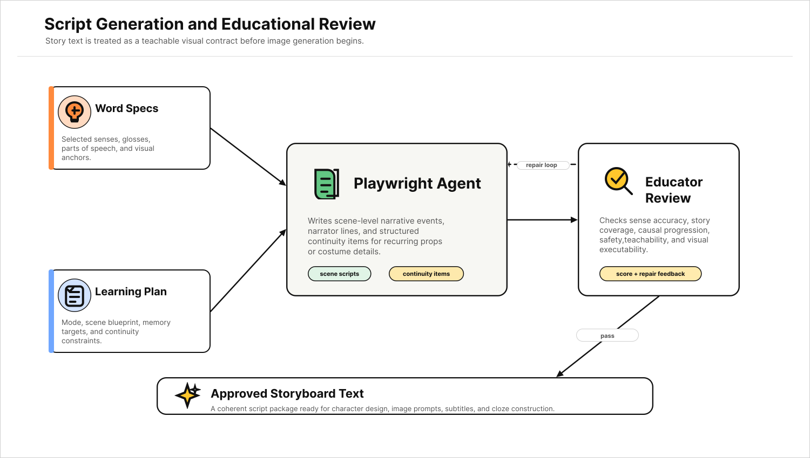
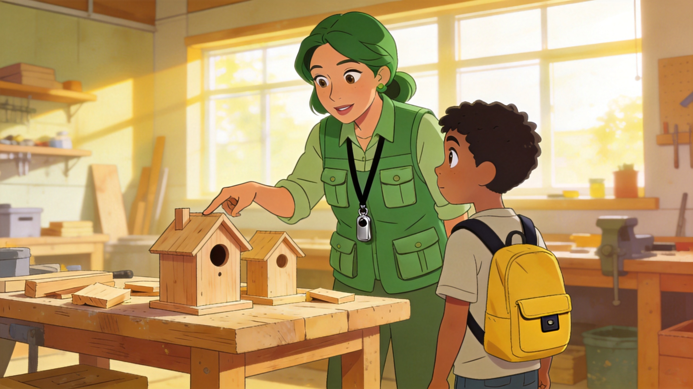
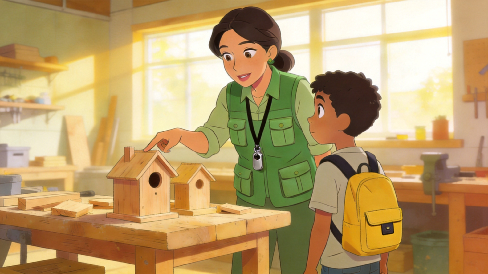
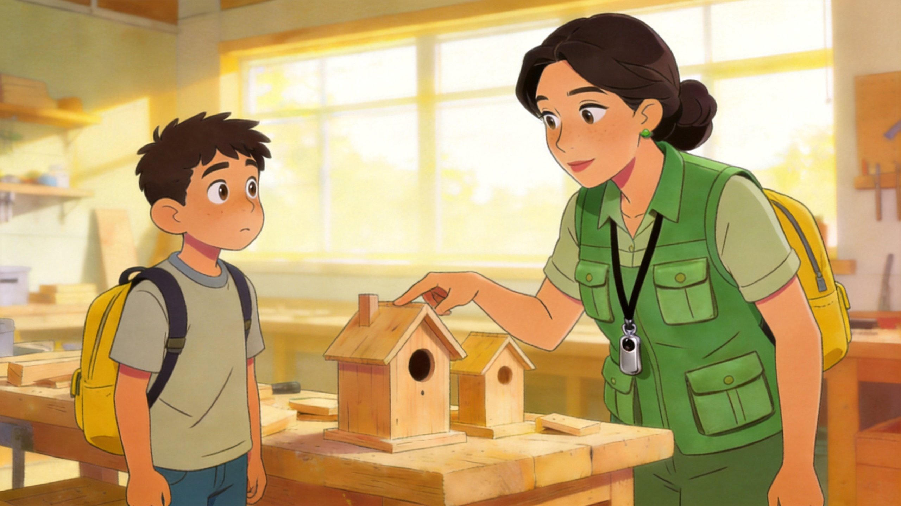

<div align="center">

# VocaVision

**AI-native vocabulary learning videos grounded in stories, visuals, narration, and active recall.**

<p>
  
  
  
  
</p>

<p>
  <a href="#overview">🌟 Overview</a> |
  <a href="#paper-snapshot">📄 Paper</a> |
  <a href="#demo-showcase">🎬 Demos</a> |
  <a href="#method">🧠 Method</a> |
  <a href="#case-study-highlights">🔎 Cases</a> |
  <a href="#quick-start">🚀 Quick Start</a> |
  <a href="#web-console">🖥️ Web Console</a>
</p>

</div>

---

<a id="overview"></a>

## 🌟 Overview

VocaVision is an educationally constrained multi-agent system for English vocabulary learning. Given a small set of target words, it produces a multimodal learning experience: a short picture-book-style story video, a visual storybook review, a cloze review video, and practice questions that help learners move from exposure to recall and transfer.

The motivation is simple: vocabulary learning should not be reduced to isolated word cards. A word becomes easier to remember when it lives inside a situation, carries a visual cue, is heard in a natural line, and returns later as something the learner must actively recall.

VocaVision operationalizes this idea as a multi-agent pipeline. It starts from meaning: each word is assigned a precise teachable sense before it ever enters a story. From there, a learning planner shapes the lesson, a playwright and educator refine the narrative, a director translates scenes into visual prompts, local and global visual reviewers guard semantic alignment and cross-scene consistency, and the media stack weaves narration, motion, subtitles, cloze review, and practice into a complete learning experience.

The system is implemented as a Python package with a CLI, a FastAPI web console, and a browser-based study portal.

> 📌 **Project goal**: VocaVision explores how generative AI can support vocabulary learning by combining semantic grounding, narrative memory, visual consistency, spoken input, and retrieval practice.

<a id="paper-snapshot"></a>

## 📄 Paper Snapshot

The research framing behind VocaVision is that generated video should be treated as a learning-design pipeline, not as a direct text-to-video prompting problem. A visually fluent video may still fail a vocabulary objective if it depicts the wrong word sense, introduces distracting objects, breaks character continuity, misspells a visible target word, or leaves learners with no retrieval practice. VocaVision therefore separates generation into accountable stages with explicit review gates.

<p align="center">
  
</p>

The system supports three learning structures, selected according to the vocabulary set:

- **Deep single-word learning** expands one seed word into a small related word family.
- **Theme story learning** integrates 2-5 words into one coherent narrative world.
- **Vocabulary sprint learning** handles larger word sets with brisk, memorable teaching beats.

<p align="center">
  
</p>

## ✨ What Makes It Different

| Challenge             | VocaVision's Design                                                                                                                     |
| --------------------- | --------------------------------------------------------------------------------------------------------------------------------------- |
| Ambiguous words       | A Sense Disambiguator records the selected sense, gloss, part of speech, visual anchors, and negative anchors before generation begins. |
| Dry vocabulary drills | A Playwright Agent turns words into situated narrative scenes with memorable cues.                                                      |
| Model hallucination   | An Educator Agent and local validators check coverage, sense accuracy, and story coherence.                                             |
| Inconsistent visuals  | Local and global VLM reviewers inspect generated keyframes and request targeted repairs.                                                |
| Passive watching      | Cloze review videos and practice questions transform viewing into active recall.                                                        |
| Expensive generation  | Asset metadata, request signatures, cached URLs, and video task recovery reduce repeated calls.                                         |

<a id="demo-showcase"></a>

## 🎬 Demo Showcase

The following videos were generated by VocaVision from different vocabulary-learning settings. If the embedded player is not displayed by your GitHub client, open the linked `.mp4` file directly.

> 🔊 **Audio note**: The demo videos contain narration. If your Markdown preview does not play audio, open the linked `.mp4` file in a video player or browser tab.

### 🌱 Word-Family Story

Target set: `care`, `caring`, `careful`, and related words.

This example turns a small word family into one connected memory story, allowing related meanings to reinforce one another through recurring characters, actions, and scenes.

<video src="assets/examples/word-family-story.mp4" controls width="100%"></video>

🔗 [Open video](assets/examples/word-family-story.mp4)

### 🧵 Cultural Vocabulary Story

Target set: `embroidery`, `souvenir`, `porcelain`, and related object words.

This example grounds concrete vocabulary in recognizable objects and cultural settings, making the scene itself part of the learner's semantic memory.

<video src="assets/examples/cultural-vocabulary-story.mp4" controls width="100%"></video>

🔗 [Open video](assets/examples/cultural-vocabulary-story.mp4)

### 🧩 Active-Recall Cloze Review

Target set: same word-family run as above.

The cloze version preserves the original visual story while blanking target words in the subtitles, encouraging learners to recover the missing words from context rather than simply rewatching passively.

<video src="assets/examples/active-recall-cloze-review.mp4" controls width="100%"></video>

🔗 [Open video](assets/examples/active-recall-cloze-review.mp4)

<a id="method"></a>

## 🧠 Method

VocaVision does not ask one model to generate an entire learning video in one step. Instead, it decomposes the lesson into a sequence of reviewable artifacts: word specifications, a learning plan, scene scripts, educator feedback, visual prompts, keyframes, local visual reviews, global storyboard reviews, media outputs, and learning exercises.

### ✍️ Script Generation and Educational Review

The Playwright Agent writes scene-level narration and plot descriptions, while the Educator Agent checks whether the story is teachable: correct word sense, age appropriateness, causal progression, visual executability, and final review of the target words. When a script fails, the feedback is sent back to the Playwright Agent as targeted repair instructions.

<p align="center">
  
</p>

### 🖼️ Visual Generation and Review

The Director Agent turns approved scripts into visual prompts. A Local Visual Reviewer checks whether each keyframe matches its scene and target word. A Global Visual Reviewer then checks whether the full storyboard preserves character identity, style, props, costumes, and cross-scene logic.

<p align="center">
  
</p>

### 📚 Learning Modes

VocaVision supports three learning formats, each tuned to a different vocabulary scale:

- `deep_single_word` expands one seed word into a small related-word family, then teaches the family through one story.
- `theme_story` places 2-5 words inside a coherent mini-story with a shared protagonist and mission.
- `vocab_sprint` handles larger word sets with compact, high-clarity scene beats and a recap.

In `auto` mode, the system chooses a structure from the word list and falls back to local rules when needed.

### 🤖 Multi-Agent Roles

| Agent                        | Role                                                             |
| ---------------------------- | ---------------------------------------------------------------- |
| Sense Disambiguator          | Selects the teachable sense of each target word.                 |
| Learning Mode Planner        | Chooses the story format and scene count.                        |
| Related Word Expansion Agent | Expands a single seed word into related learning targets.        |
| Playwright Agent             | Writes scene-level story scripts.                                |
| Educator Agent               | Reviews sense accuracy, teachability, and story coherence.       |
| Director Agent               | Converts story scenes into image-generation prompts.             |
| Local Visual Reviewer        | Checks whether each keyframe matches its target word and script. |
| Global Visual Reviewer       | Checks cross-scene continuity and consistency.                   |
| Teaching Agent               | Produces cloze and practice questions.                           |

### 🧪 Teaching Agent and Learner Loop

The final video is only one part of the learning material. VocaVision also produces cloze review and practice questions, so learners can retrieve target words from the same visual and narrative context where they first encountered them.

<p align="center">
  
</p>

<p align="center">
  
</p>

### 🎞️ Audio-Video Alignment

Image-to-video clips are configured as 5-second clips, while TTS narration has variable duration. VocaVision uses FFmpeg to make the generated motion follow the narration instead of forcing the narration into a fixed duration:

- short narration trims the generated clip;
- longer narration slows the clip with `setpts`;
- ASS subtitles are burned into each scene;
- scene clips are concatenated into the final output.

<a id="case-study-highlights"></a>

## 🔎 Case Study Highlights

### 🐰 Script Review: From Word Examples to a Learning Story

For the word family `care`, `caring`, `careful`, and `careless`, a baseline script used the target words correctly at the sentence level but jumped among unrelated events. VocaVision's review loop reframed the words into a classroom-rabbit story, then improved causal continuity, recurring visual props, and final word-family consolidation.

<p align="center">
  
</p>

### 🏦 Local Visual Review: Correcting Visible Target-Word Text

Generated images can fail in small but pedagogically serious ways. In the example below, the visible target word `BANK` was initially rendered incorrectly. Local visual review rejected the frame and triggered a repair.

<p align="center">
  
  
</p>

### 🧭 Global Visual Review: Repairing Cross-Scene Consistency

Local scene checks are not enough when a recurring character changes across the storyboard. Global visual review identifies cross-scene drift and regenerates only the problematic scenes.

<p align="center">
  
  
  
</p>

## 📁 Repository Structure

```text
.
├── assets/case-studies/     # Qualitative examples used in the paper
├── assets/examples/         # Curated generated demo videos
├── photo/                   # Paper figures used in this README
├── src/vocavision/
│   ├── agents/              # Multi-agent prompts and model-facing logic
│   ├── post_processing/     # Subtitle rendering and FFmpeg tools
│   ├── services/            # LLM, image, video, TTS, and download wrappers
│   ├── utils/               # JSON, text, and cache helpers
│   ├── web/                 # Static frontend
│   ├── pipeline.py          # End-to-end orchestration
│   ├── state.py             # Pydantic project state
│   ├── web_app.py           # FastAPI application
│   ├── config.py            # Runtime settings
│   └── main.py              # CLI entrypoint
├── main.py                  # Local launcher
├── pyproject.toml           # Package metadata
├── requirements.txt         # Runtime dependency list
├── .env.example             # Environment variable template
└── README.md
```

<a id="quick-start"></a>

## 🚀 Quick Start

### 1. Clone and enter the project

```bash
git clone <your-repo-url>
cd VocaVision
```

### 2. Create a virtual environment

Windows PowerShell:

```powershell
python -m venv .venv
.\.venv\Scripts\Activate.ps1
python -m pip install --upgrade pip
```

macOS / Linux:

```bash
python -m venv .venv
source .venv/bin/activate
python -m pip install --upgrade pip
```

### 3. Install dependencies

Recommended:

```bash
pip install -e .
```

Alternative runtime-only installation:

```bash
pip install -r requirements.txt
```

### 4. Install FFmpeg

VocaVision requires both `ffmpeg` and `ffprobe`.

```bash
ffmpeg -version
ffprobe -version
```

If these commands are unavailable, install FFmpeg and set explicit executable paths in `.env`.

### 5. Configure API keys

Copy the environment template:

```bash
cp .env.example .env
```

Windows PowerShell:

```powershell
Copy-Item .env.example .env
```

Fill in:

```text
DASHSCOPE_API_KEY=your_dashscope_api_key
ARK_API_KEY=your_volcengine_ark_api_key
VOCAVISION_WORKSPACE_ROOT=workspace
VOCAVISION_FFMPEG_BIN=ffmpeg
VOCAVISION_FFPROBE_BIN=ffprobe
```

For Windows, if FFmpeg is not on `PATH`, use absolute paths:

```text
VOCAVISION_FFMPEG_BIN=C:\path\to\ffmpeg.exe
VOCAVISION_FFPROBE_BIN=C:\path\to\ffprobe.exe
```

### 6. Validate the environment

```bash
python main.py validate-env
```

This command checks key runtime prerequisites and reports the active workspace and video-processing stack.

### 7. Run a small generation example

```bash
python main.py run --project-id demo-rabbit-carrot --words rabbit carrot --test-mode --auto-accept-senses
```

Theme-story example:

```bash
python main.py run --project-id demo-theme-story --words curious careful brave --learning-mode theme_story --auto-accept-senses
```

Storyboard-only example:

```bash
python main.py run --project-id demo-storyboard --words curious careful brave --storyboard-only --auto-accept-senses
```

<a id="web-console"></a>

## 🖥️ Web Console

Start the local web application:

```bash
python main.py web --host 127.0.0.1 --port 8000
```

Open:

```text
http://127.0.0.1:8000
```

The web console provides a lightweight interface for the full generation workflow:

- environment inspection;
- target-word input;
- sense suggestion and selection;
- learning-mode configuration;
- storyboard-only runs;
- full video generation;
- progress polling;
- review panels for story, local visual checks, and global visual checks;
- final artifact preview.

## 📝 Study Portal

After generating at least one completed project, open:

```text
http://127.0.0.1:8000/study
```

The study portal turns generated projects into a learner-facing experience:

- anonymous learning sessions;
- storybook scene review;
- final video playback;
- cloze review video playback;
- cloze questions;
- practice questions;
- survey submission;
- optional pairwise video comparison.

## 📦 Output Layout

Each run is stored under `workspace/{project_id}`:

```text
workspace/{project_id}/
├── audio/        # TTS audio
├── final/        # final_video.mp4 and final_cloze_video.mp4
├── images/       # character reference and scene keyframes
├── logs/         # JSONL generation traces
├── state/        # project_state.json
├── subtitles/    # ASS subtitles
├── temp/         # concat files
└── video/        # raw and merged scene videos
```

Commonly inspected files:

```text
workspace/{project_id}/state/project_state.json
workspace/{project_id}/logs/events.jsonl
workspace/{project_id}/logs/story_iterations.jsonl
workspace/{project_id}/logs/visual_iterations.jsonl
workspace/{project_id}/logs/global_visual_iterations.jsonl
workspace/{project_id}/final/final_video.mp4
workspace/{project_id}/final/final_cloze_video.mp4
```

## ⚙️ Configuration Notes

Useful environment variables:

| Variable                              | Meaning                                                             |
| ------------------------------------- | ------------------------------------------------------------------- |
| `VOCAVISION_WORKSPACE_ROOT`           | Directory for generated projects.                                   |
| `VOCAVISION_IMAGE_MODEL`              | Image generation model name.                                        |
| `VOCAVISION_IMAGE_SIZE`               | Keyframe size.                                                      |
| `VOCAVISION_VIDEO_MODEL`              | Image-to-video model name.                                          |
| `VOCAVISION_STORY_MAX_ITERATIONS`     | Maximum story repair rounds.                                        |
| `VOCAVISION_STORY_SCORE_THRESHOLD`    | Story acceptance threshold.                                         |
| `VOCAVISION_VISUAL_MAX_RETRIES`       | Scene-level visual regeneration retries.                            |
| `VOCAVISION_GLOBAL_VISUAL_MAX_ROUNDS` | Global visual review rounds.                                        |
| `VOCAVISION_MEDIA_MAX_WORKERS`        | Media-stage concurrency.                                            |
| `VOCAVISION_REUSE_CACHED_ASSETS`      | Whether to reuse generated assets with matching request signatures. |

## ⭐ Support

If VocaVision feels useful, inspiring, or simply worth following, please consider starring this repository. It helps others discover the project and encourages continued development.

Made with ❤️. We hope VocaVision can help make children's English vocabulary learning more vivid, memorable, and joyful.
